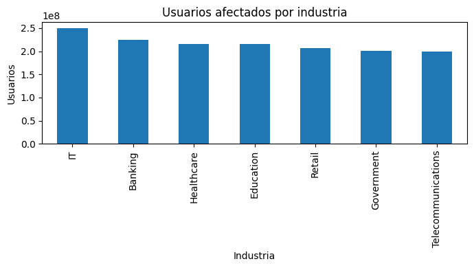
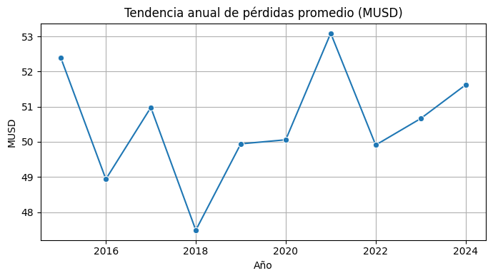
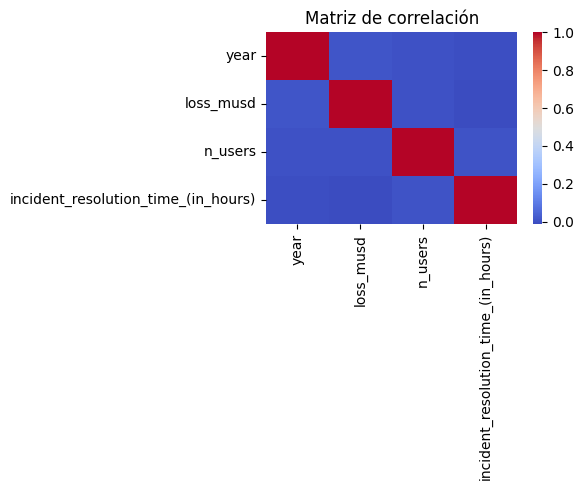
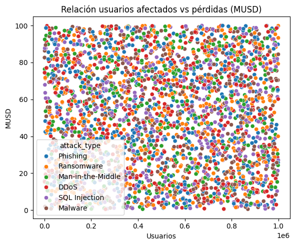
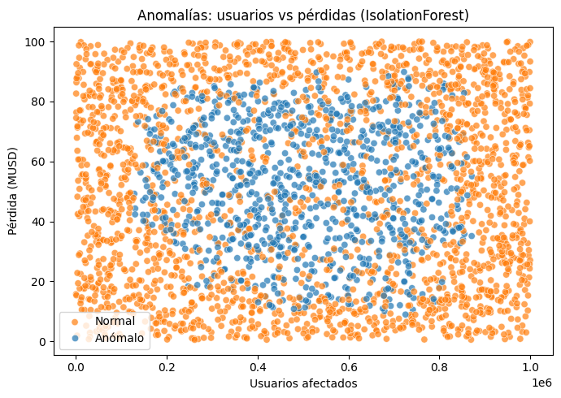
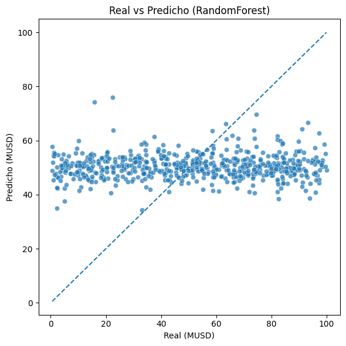

# Informe de Análisis: Ciberataques Globales (2015–2024)

## Resumen ejecutivo
Este informe analiza ciberataques registrados entre 2015 y 2024 con énfasis en **pérdidas económicas (USD millones)** y **usuarios afectados**. Se realizó limpieza del dataset, un **EDA** con visualizaciones clave y, como valor agregado, **detección de anomalías** y un **modelo base de predicción** de pérdidas. Los resultados permiten identificar **ataques e industrias con mayor impacto**, así como posibles **outliers** útiles para priorización.

---

## 1. Coordinación y repositorio
- **Repositorio central:** `Bryan810/Grupo_9_tarea_3`
- **Ramas de trabajo:** `BRYAN_SALTOS`,` MARLOS_FREIRE`, `JEAN_MOLINA` (desarrollo) → Pull Request → `master` (integración)
- **Colaboración:** commits atómicos, PRs con descripción y revisión.
- **Coordinación:** 👉 COMPLETAR (BRYAN SALTOS).

---

## 2. Dataset
- **Fuente principal:** Kaggle 👉 COMPLETAR (pegar enlace exacto)
- **Archivo base:** `data/Global_Cybersecurity_Threats_2015-2024.csv`
- **Variables principales:**
  - `Year` (año), `Country` (país)
  - `Attack Type` (tipo de ataque)
  - `Target Industry` (industria objetivo)
  - `Financial Loss (in Million $)` → renombrada a `loss_musd`
  - `Number of Affected Users` → renombrada a `n_users`
- **Archivos auxiliares:** `country_coordinates.csv` (coordenadas por país) y `salaries_cyber.csv`.

**Criterio de selección:** dataset con **cobertura temporal amplia**, variables **económicas y de impacto**, y capacidad de generar **insights accionables** para ciber‐riesgo.

---

## 3. Procesamiento de datos
**Objetivo:** obtener un dataset consistente y analizable.

**Pasos ejecutados en `sample.ipynb`:**
1. **Estandarización de columnas** (minúsculas, `snake_case`) y renombres:
   - `financial_loss_(in_million_$)` → `loss_musd`
   - `number_of_affected_users` → `n_users`
2. **Conversión de tipos** (`year`, `loss_musd`, `n_users` a numérico).
3. **Eliminación de duplicados**.
4. **Tratamiento de nulos** (imputación con **mediana** en columnas numéricas).
5. **Exportación de dataset limpio:** `data/threats_clean.csv`.

> Resultado: dataset listo para EDA, visualizaciones y modelos.

---

## 4. Análisis exploratorio de datos (EDA)

### 4.1 Pérdida total por tipo de ataque


**Hallazgo:** ataques como **DDoS** y **Phishing** tienden a concentrar mayor pérdida económica agregada. 👉 Ajustar si tu gráfico muestra otro orden.

### 4.2 Usuarios afectados por industria


**Hallazgo:** **IT** y **Banking** se ubican entre las industrias con mayor número de usuarios afectados. 👉 Ajustar con tu resultado.

### 4.3 Tendencia anual de pérdidas


**Hallazgo:** se observa la evolución de la **pérdida promedio por año**; 👉 COMPLETAR con tu lectura (p. ej., “ligera tendencia al alza en los años recientes”).

### 4.4 Correlaciones entre variables


**Hallazgo:** relación entre las métricas numéricas; 👉 COMPLETAR si existe correlación destacada (p. ej., `n_users` y `loss_musd`).

### 4.5 Relación usuarios vs pérdidas


**Hallazgo:** visualiza si **más usuarios afectados** se traduce en **mayor pérdida** o si hay alta dispersión diferenciada por **tipo de ataque**.

### 4.6 Mapa interactivo (opcional)
Archivo HTML: [`mapa_ciberataques.html`](./mapa_ciberataques.html)  
**Uso:** explorar **concentración geográfica** de incidentes por país.

---

## 5. Visualización de datos
Se emplearon **matplotlib**, **seaborn** y **plotly/folium** para gráficos informativos y legibles:
- Barras comparativas, **líneas temporales** y **heatmaps** para patrones.
- **Scatter** para relaciones entre métricas.
- **Mapas** (folium) para vista geográfica.

> Todas las figuras exportadas están en `docs/`.

---

## 6. Principales hallazgos
- **Ataques más costosos:** 👉 COMPLETAR con lo observado (p. ej., DDoS y Phishing).
- **Industrias más expuestas:** 👉 COMPLETAR (p. ej., IT y Banking por usuarios afectados).
- **Tendencia temporal:** 👉 COMPLETAR (p. ej., “incremento moderado de pérdidas recientes”).
- **Relaciones relevantes:** 👉 COMPLETAR (mencionar correlaciones o ausencia de ellas).
- **Países o combinaciones atípicas:** ver sección de anomalías.

---

## 7. Documentación del trabajo (este README)
- **Propósito del dataset:** descrito en §2.
- **Limpieza y transformación:** descritas en §3.
- **EDA y visualizaciones:** resultados y gráficos en §4–§5.
- **Insights/conclusiones:** §6 y §9.

---

## 8. Entregable
- **Repositorio GitHub:** enlace al repo con todo el trabajo centralizado.  
- **Ramas y PR:** `JEAN_MOLINA` → `master` (historial de integración).

---

## 9. Conclusiones y recomendaciones
1. **Priorizar mitigación** en ataques con mayor pérdida agregada (👉 COMPLETAR con tipos identificados).  
2. **Industrias críticas** deberían robustecer controles (👉 COMPLETAR con industrias).  
3. **Monitoreo continuo** de métricas atípicas (ver sección de anomalías) para respuesta temprana.  
4. **Trabajo futuro:** enriquecer con variables externas (inversión en ciberseguridad, madurez regulatoria, PIB, etc.) para mejorar la **capacidad predictiva**.

---

## 10. Valor agregado (puntos extra)

### 10.1 Detección de anomalías — IsolationForest


- **Variables:** `loss_musd`, `n_users` (y `year` si estaba disponible).
- **Salida:** `data/threats_anomalies.csv`
- **Interpretación:** casos marcados como anómalos representan **outliers** de impacto que ameritan análisis específico (p. ej., campañas o incidentes puntuales).

👉 COMPLETAR: “Se detectaron **N** anomalías” (ver impresión del notebook).

### 10.2 Predicción de pérdidas — RandomForestRegressor


- **Pipeline:** One-Hot para categóricas + escalado para numéricas; búsqueda de hiperparámetros con `GridSearchCV`.
- **Métricas:** ver `docs/ml_regression_metrics.json` (contiene **MAE** y **R²**).  
- **Salida:** `data/predicciones_loss.csv` (valores reales, predichos y residuales).
- **Lectura:** usar como **línea base**; se recomienda incorporar más features (temporales/país/industria) para mejorar desempeño.

👉 COMPLETAR: “MAE = **X** MUSD, R² = **Y**” (copiar del JSON impreso por el notebook).

---

## 11. Reproducibilidad
```bash
# Dependencias
pip install -r requirements.txt

# Ejecución
# Abrir y ejecutar todas las celdas de sample.ipynb
# Se regeneran:
#   data/threats_clean.csv
#   docs/*.png
#   data/threats_anomalies.csv
#   data/predicciones_loss.csv
#   docs/ml_regression_metrics.json
