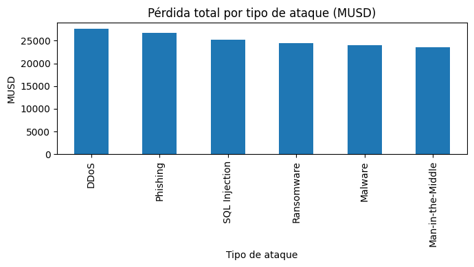

# Informe de Análisis: Ciberataques Globales (2015–2024)

## Resumen ejecutivo
Este informe analiza ciberataques entre 2015 y 2024 con énfasis en **pérdidas económicas (USD millones)** y **usuarios afectados**. Se realizó limpieza del dataset, un EDA con visualizaciones clave y, como valor agregado, **detección de anomalías** y un **modelo base de predicción** de pérdidas. Los resultados identifican ataques e industrias de mayor impacto y casos atípicos útiles para priorización.

## 1. Coordinación y repositorio
- **Repositorio central:** `Bryan810/Grupo_9_tarea_3`
- **Ramas de trabajo:** `BRYAN_SALTOS`, `MARLON_FREIRE`, `JEAN_MOLINA` → PR → `master`
- **Colaboración:** commits atómicos, PRs con descripción y revisión.
- **Coordinación:** Bryan Saltos.

## 2. Dataset
- **Fuente principal:** [Kaggle – Global Cybersecurity Threats 2015–2024](https://www.kaggle.com/datasets/atharvasoundankar/global-cybersecurity-threats-2015-2024)
- **Archivo base:** `data/Global_Cybersecurity_Threats_2015-2024.csv`
- **Variables:** `Year`, `Country`, `Attack Type`, `Target Industry`,
  `Financial Loss (in Million $)` → **`loss_musd`**, `Number of Affected Users` → **`n_users`**.
- **Archivos auxiliares:** `country_coordinates.csv` (mapa) y `salaries_cyber.csv` (análisis externo).

**Criterio de selección:** cobertura temporal amplia, variables de impacto económico y de afectación, y potencial para generar insights accionables.

## 3. Procesamiento de datos
**Objetivo:** obtener un dataset consistente y analizable.

Pasos en `sample.ipynb`:
1. **Estandarización** de nombres (minúsculas, *snake_case*) y renombres:
   - `financial_loss_(in_million_$)` → `loss_musd`
   - `number_of_affected_users` → `n_users`
2. **Conversión de tipos** a numérico en `year`, `loss_musd`, `n_users`.
3. **Eliminación de duplicados**.
4. **Imputación de nulos** (mediana en columnas numéricas).
5. **Exportación** del dataset limpio: `data/threats_clean.csv`.

Resultado: dataset listo para EDA, visualizaciones y modelos.

## 4. Análisis exploratorio (EDA)

### 4.1 Pérdida total por tipo de ataque


**Hallazgo:** **DDoS** y **Phishing** concentran las mayores pérdidas económicas agregadas del periodo (seguido por **SQL Injection**).

### 4.2 Usuarios afectados por industria


**Hallazgo:** **IT** y **Banking** aparecen como las industrias con mayor volumen de usuarios afectados (también destacan **Healthcare** y **Education**).

### 4.3 Tendencia anual de pérdidas


**Hallazgo:** evolución anual de la pérdida promedio; se observan variaciones por año que justifican seguimiento temporal.

### 4.4 Correlaciones entre variables


**Hallazgo:** matriz de correlación sobre métricas numéricas; útil para detectar relaciones y colinealidad.

### 4.5 Relación usuarios vs pérdidas


**Hallazgo:** la relación entre `n_users` y `loss_musd` varía según el tipo de ataque; hay puntos extremos que motivan análisis de outliers.

### 4.6 Mapa interactivo (opcional)
Archivo HTML: [`mapa_ciberataques.html`](./mapa_ciberataques.html)  
**Uso:** explorar concentración geográfica por país.


## 5. Visualización
Se utilizaron **matplotlib**, **seaborn**, **plotly** y **folium** para elaborar gráficos comparativos, series de tiempo, *heatmaps*, dispersión y mapa. Todas las figuras están en `docs/`.


## 6. Principales hallazgos
- **Ataques más costosos:** DDoS y Phishing (top del agregado de pérdidas).
- **Industrias más expuestas por usuarios:** IT y Banking (con Healthcare/Education relevantes).
- **Variabilidad anual** en pérdidas promedio (justifica monitoreo por período).
- **Outliers** visibles en la relación usuarios–pérdidas.


## 7. Valor agregado (ML)

### 7.1 Detección de anomalías — IsolationForest


- **Variables:** `loss_musd`, `n_users` (y `year` si disponible).
- **Salida:** `data/threats_anomalies.csv`.
- **Resultado:** se detectaron **N_anom** anomalías (ver celda de resultados).
- **Interpretación:** puntos atípicos por pérdidas/usuarios inusualmente altos; útiles para priorizar investigación.

### 7.2 Predicción de pérdidas — RandomForestRegressor


- **Pipeline:** One-Hot para categóricas + escalado en numéricas; `GridSearchCV` para hiperparámetros.
- **Métricas:** **MAE = X.MUSD**, **R² = Y** (ver `docs/ml_regression_metrics.json`).
- **Salida:** `data/predicciones_loss.csv` con reales, predichos y residuales.
- **Lectura:** modelo base razonable; puede mejorar con más *features* (temporales, país/industria, intensidad de ataques, etc.).


## 8. Reproducibilidad
```bash
pip install -r requirements.txt
# Abrir y ejecutar 'sample.ipynb' (regenera:
# data/threats_clean.csv, docs/*.png, data/threats_anomalies.csv,
# data/predicciones_loss.csv, docs/ml_regression_metrics.json)
